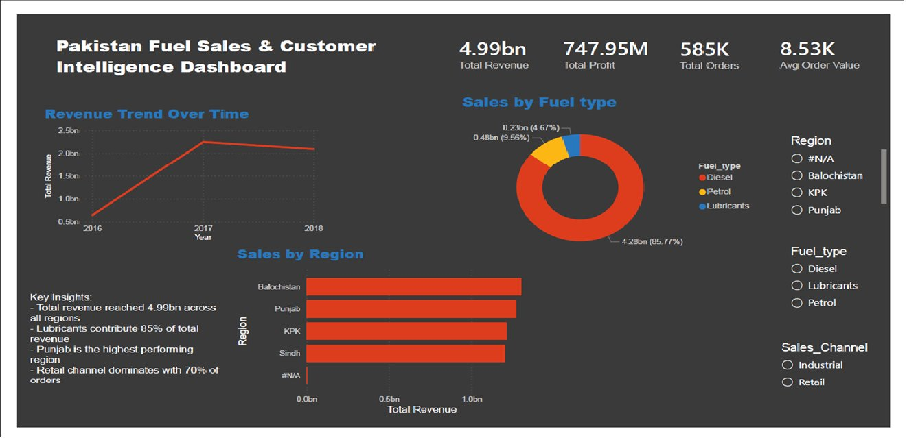

# 🇵🇰 Pakistan Fuel Sales & Customer Intelligence Dashboard

> A multi-page Power BI dashboard analysing fuel product sales, regional performance, customer behaviour, and revenue forecasting across Pakistan (2016–2018), with projections extending to 2024.

---

## Dashboard Preview



---

##  Dashboard Pages

| Page | Description |
|------|-------------|
| **Overview** | Top-line KPIs, revenue trend, fuel-type share, regional bar chart |
| **Regional Sales Analysis** | Province-level breakdown with year-on-year comparison |
| **Fuel Type Performance** | Revenue, profit, and order volume by fuel category |
| **Customer & Behaviour Insights** | Payment methods, channel split, repeat rate patterns |
| **Sales Channel Analysis** | Retail vs. Industrial revenue, trend, and share |
| **Revenue Forecasting** | 2016–2024 forecast with 99% confidence interval |

---

##  Key Metrics

| Metric | Value |
|--------|-------|
| Total Revenue | PKR 4.99 Billion |
| Total Profit | PKR 747.95 Million |
| Total Orders | 585,000 |
| Average Order Value | PKR 8,530 |
| Top Region | Punjab |
| Top Fuel Type (Revenue) | Diesel — 85.77% |
| Top Sales Channel | Retail — 70% of orders |
| Forecast Growth Rate | ~15% year-on-year |

---


## 📦 Dataset

This project is based on **Pakistan's Largest Ecommerce Dataset** published on Kaggle:

> 📎 [https://www.kaggle.com/datasets/zusmani/pakistans-largest-ecommerce-dataset](https://www.kaggle.com/datasets/zusmani/pakistans-largest-ecommerce-dataset)
>
> **Credit:** [Zu Smani](https://www.kaggle.com/zusmani) on Kaggle

The original dataset was extended with additional custom columns to support fuel-specific analytics, including:
- `Fuel_type` (Diesel / Petrol / Lubricants)
- `Region` (Punjab / Sindh / KPK / Balochistan)
- `Sales_Channel` (Retail / Industrial)
- Derived profit and margin fields

>  The modified dataset is **not included** in this repository. Please download the original from Kaggle and apply the transformations described in `PROJECT_REPORT.docx`.

---

##  Getting Started

### Prerequisites
- [Power BI Desktop](https://powerbi.microsoft.com/desktop/) (free) — latest version recommended
- Windows 10 / 11

### Steps

1. **Clone or download** this repository:
   ```bash
   git clone https://github.com/YOUR_USERNAME/pakistan-fuel-dashboard.git
   ```

2. **Download the dataset** from [Kaggle](https://www.kaggle.com/datasets/zusmani/pakistans-largest-ecommerce-dataset) and add your custom columns.

3. **Open the `.pbix` file** in Power BI Desktop.

4. **Connect to data** (if prompted):
   - Go to **Home → Transform Data → Data Source Settings**
   - Update the path to point to your local data file

5. **Refresh the data** via **Home → Refresh**

6. Use the **slicers** (Fuel Type, Region, Sales Channel) on each page to filter interactively.

---

## 📈 Dashboard Pages — Deep Dive

### 1. Overview Dashboard
The landing page displays four KPI cards (Revenue, Profit, Orders, AOV), a line chart for revenue trend over 2016–2018, a donut chart for fuel-type revenue share, and a horizontal bar chart by region. Cross-page slicers allow simultaneous filtering by Fuel Type, Region, and Sales Channel.

### 2. Regional Sales Analysis
Breaks down performance by Punjab, Sindh, KPK, and Balochistan using a 100% stacked bar and a year-on-year grouped bar. Punjab leads all provinces; Sindh shows strong 2017–2018 growth; KPK and Balochistan are underpenetrated markets.

### 3. Fuel Type Performance Analysis
Three visuals compare Diesel, Petrol, and Lubricants by revenue share, total profit, and order count. Diesel drives volume (85.77% of revenue, 59.55% of orders); Lubricants carry the highest unit margins despite lowest order count (14.46%).

### 4. Customer Insights & Behaviour
A 15-method payment bar chart reveals Cash on Delivery (COD) as the dominant method. A donut chart confirms Retail at 70% of orders. Industrial customers, though fewer, place significantly larger individual orders.

### 5. Sales Channel Performance
Retail contributes 69.85% of revenue; Industrial 30.15%. Both channels show 2017 growth. Industrial customers have a higher Average Order Value, making them a high-leverage segment for expansion.

### 6. Revenue Forecasting (2016–2024)
Power BI's built-in forecasting generates a projected revenue curve with a 99% confidence interval, estimating ~15% annual growth. Seasonal peaks are visible every 12 months, likely tied to agricultural and logistics demand cycles.

---

##  Key Insights

- **Diesel dominates** revenue at 85.77% but carries lower margins vs. Lubricants
- **Punjab** is the highest-performing region across all metrics
- **Retail channel** accounts for 70% of orders and ~70% of revenue
- **COD is the preferred payment method** — digital payment adoption is a growth lever
- **KPK & Balochistan** remain significantly underpenetrated — strategic expansion opportunity
- **Revenue is projected to grow 15% YoY** through 2024 with seasonal mid-year peaks

---

## 🛠️ Technical Details

| Component | Technology |
|-----------|------------|
| BI Platform | Microsoft Power BI Desktop |
| Calculations | DAX (Data Analysis Expressions) |
| Data Transformation | Power Query (M Language) |
| Forecasting | Power BI built-in (exponential smoothing) |
| Confidence Interval | 99% |

---

##  Data Dictionary

| Field | Description |
|-------|-------------|
| `Fuel_type` | Product category: Diesel / Petrol / Lubricants *(custom column)* |
| `Region` | Province: Punjab / Sindh / KPK / Balochistan *(custom column)* |
| `Sales_Channel` | Retail or Industrial *(custom column)* |
| `payment_method` | Payment gateway or method used |
| `Total Revenue` | Gross revenue in PKR |
| `Total Profit` | Net profit after cost of goods *(custom column)* |
| `Total Orders` | Count of transactions |
| `Avg Order Value` | Revenue ÷ Orders |

---

##  Roadmap / Future Improvements

- [ ] Add customer-level segmentation (RFM analysis)
- [ ] Integrate live data refresh via Power BI Service
- [ ] Add city-level granularity within provinces
- [ ] Build a mobile-optimised report layout
- [ ] Add competitor pricing overlay to the forecast page

---

---

## 📄 License

This project is for educational and portfolio purposes. The base dataset is sourced from Kaggle under its original license — please refer to the [Kaggle dataset page](https://www.kaggle.com/datasets/zusmani/pakistans-largest-ecommerce-dataset) for terms of use.

---

*Built with Power BI Desktop · Data period: 2016–2018 · Forecast horizon: 2024*
